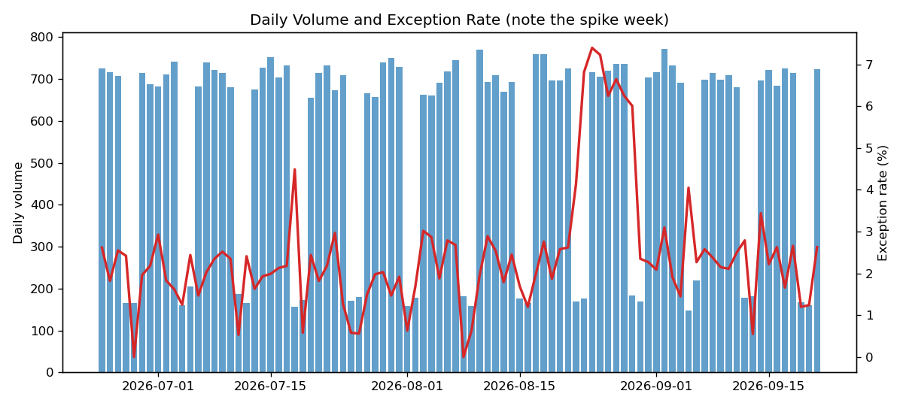
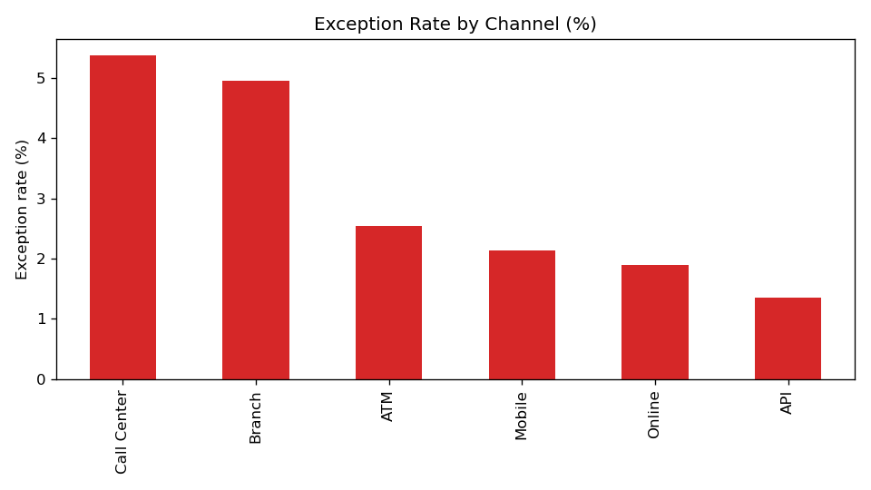
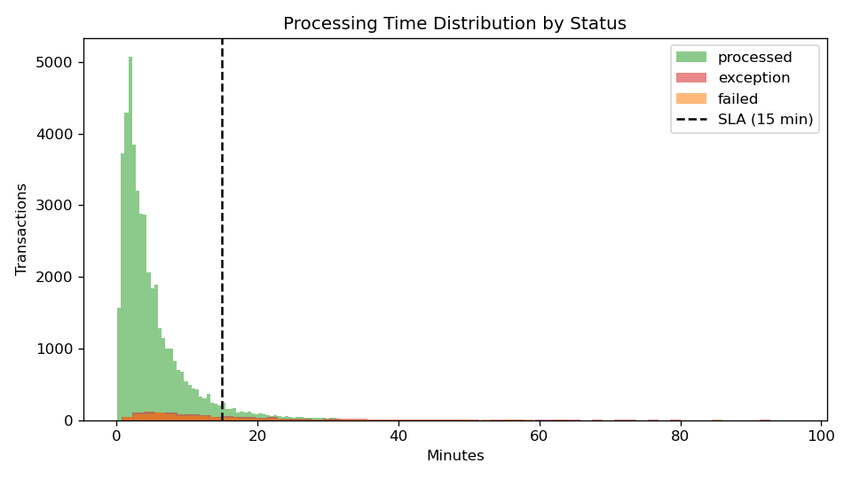

# Bank Transaction Operations Analytics

End-to-end operations analytics on **50,000 synthetic bank transactions** — the kind of exception monitoring, SLA tracking, and source-to-report reconciliation work that keeps a bank's payments operations honest.

## Problem statement

Operations leaders need to know: *where are transactions failing, which channels are missing processing SLAs, and can the reported numbers be trusted?* This project answers those questions with a reproducible pipeline — synthetic data generation, Python analysis, and SQL KPIs — mirroring day-to-day reporting in a bank operations team.

## Dataset

All data is **synthetic** (generated by `generate_data.py`, seeded for reproducibility). No real customer data.

| Column | Description |
|---|---|
| `transaction_id` | Unique-ish transaction reference (SHA-256 based, with ~1% injected duplicates) |
| `date` | Business date (90-day window, weekday-weighted volume) |
| `account_id` | Hashed account identifier |
| `transaction_type` | ACH, Wire, Check, Card, Zelle/P2P, Bill Pay |
| `channel` | Online, Branch, Mobile, ATM, Call Center, API |
| `amount` | Transaction amount (lognormal, type-scaled) |
| `status` | processed / pending / failed / exception |
| `exception_reason` | Populated only for exceptions |
| `region` | US region (0.5% missing, by design) |
| `processing_time_mins` | End-to-end processing time in minutes |

- `data/sample_transactions.csv` — 2,000-row sample for quick exploration (committed).
- The full 50,000-row dataset is generated on demand with `python generate_data.py` (excluded from git via `.gitignore`).

## Methods

1. **Data generation** — seeded RNG builds realistic type→channel mixes, a one-week exception spike (simulating a vendor incident), slower processing for wires and exception cases, and ~1% duplicate transaction IDs.
2. **Python analysis (`analysis.py`)** — pandas: exception rates by channel/type/region, 15-minute SLA breach analysis, daily volume trends, duplicate detection, null/negative-value data-quality checks, and a source-to-report reconciliation (raw totals vs. grouped report totals).
3. **SQL KPIs (`sql/`)** — `schema.sql` creates the table; `kpi_queries.sql` has 10 analytical queries (CTEs, window functions, `FILTER`, `CASE`, percentile, week-over-week lags) answering questions like *"exception rate by channel over time"* and *"which region × type cell is worst?"*
4. **Charts** — matplotlib visuals saved to `images/`.

## Key findings

*Based on the seeded 50,000-row dataset:*

- **Overall exception rate: 2.54%** — within typical ops tolerance, but unevenly distributed.
- **Call Center (5.38%) and Branch (4.95%)** have the highest exception rates by channel; API is lowest at 1.35%.
- **Wires (6.29%) and Checks (5.81%)** are the riskiest transaction types — consistent with their manual/compliance-heavy handling.
- **A one-week exception spike peaked on 2026-08-24 at 7.40%** — roughly 3× the baseline, the signature of a vendor/incident event that an ops report should surface and explain.
- **SLA breach rate is 7.38%** (15-minute target); exceptions and wires process materially slower than the norm.
- **495 duplicate transaction IDs (990 rows)** were detected — potential double-submissions worth investigating.
- **Source-to-report reconciliation: PASS** — grouped report totals tie exactly to source ($323,937,895.44).
- Data-quality audit: ~0.5% of rows are missing `region`; no negative or zero amounts.





## Skills demonstrated

Python (pandas, matplotlib) · SQL (CTEs, window functions, conditional aggregation) · KPI design · SLA & exception analysis · data-quality auditing · reconciliation · reproducible synthetic data pipelines

## How to run

```bash
# 1. Create the dataset (50k rows) + 2k sample
python generate_data.py

# 2. Run the full analysis (KPI summary + charts)
python analysis.py

# 3. Or analyze just the committed sample
python analysis.py --data data/sample_transactions.csv
```

Requirements: Python 3.10+, `pip install -r requirements.txt`.

## Project structure

```
├── generate_data.py        # Synthetic dataset generator (seeded, reproducible)
├── analysis.py             # KPI analysis + chart generation
├── requirements.txt
├── LICENSE
├── data/
│   └── sample_transactions.csv   # 2,000-row committed sample
├── sql/
│   ├── schema.sql          # Table definition
│   └── kpi_queries.sql     # 10 analytical KPI queries
└── images/
    ├── exception_rate_by_channel.png
    ├── exception_rate_by_type.png
    ├── daily_volume_exceptions.png
    ├── processing_time_by_status.png
    ├── sla_breach_by_type.png
    └── kpi_summary.csv
```

*All data is synthetic and generated locally — nothing here contains real customer information.*
